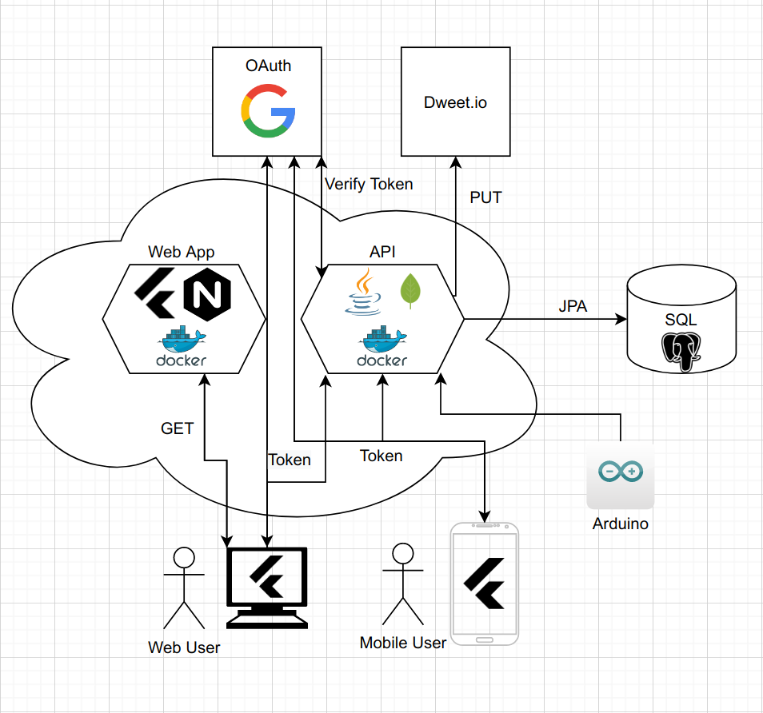

# FeedApp

## Use Cases

* **Vote public polls:** Anyone can vote on public polls via the public polls screen.
* **Register:** Everyone can register as a user
* **Login:** Registered users are able to log in
* **Create polls:** Only registered users who are logged in can create polls.
* **Close polls:** Logged in users who has created a poll, are able to close their poll.
* **Vote private polls:** Only users who are registered and logged in can vote on private polls.
* **Manage users:** The administrators are the only ones who can manage users by deleting, adding or editing them.

## Domain model

## Application Flow

## User Screens

## Architectural Diagram

