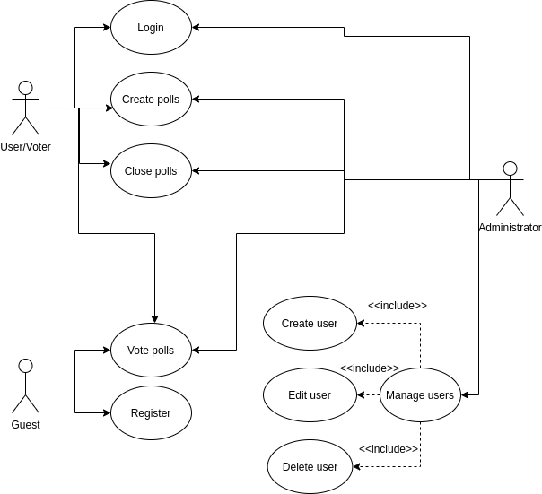
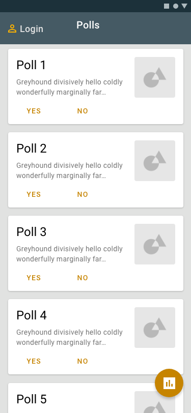
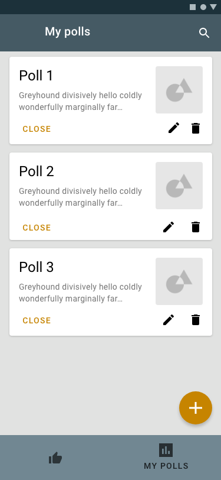

# FeedApp

## Use Cases

- **Vote public polls:** Anyone can vote on public polls via the public polls screen.
- **Register:** Everyone can register as a user
- **Login:** Registered users are able to log in
- **Create polls:** Only registered users who are logged in can create polls.
- **Close polls:** Logged in users who has created a poll, are able to close their poll.
- **Vote private polls:** Only users who are registered and logged in can vote on private polls.
- **Manage users:** The administrators are the only ones who can manage users by deleting, adding or editing them.

## Domain model

## Application Flow

The application consists of five screens. The home screen is the `Public polls screen` where the user can chose to vote on a public poll, join a poll by a code or log in on the `Login screen`. When the user is logged in, they have more possibilities, and are able to create both public and private polls, which is accessed through the `My polls screen`, which is a list of the user's created polls.
If the user who is logged is an admin, they are able to manage the users.

## User Screens

### Polls screen

The main screen of the application. Guests can view and vote on available public polls. The button in the bottom right opens the "join poll" popup, where the guest can enter a code to access a specific public poll. Logged in users can utilize the same popup to access private polls. The top right button redirects to the login screen.

### Login screen

Users can enter their credentials to log in to the application. The back button leads back to the Polls screen.

### Join poll screen

When tapping the button for joining a poll, the user gets a popup where they can enter the code for a poll in order to vote on it. Guests can access public polls, while logged in users can access both public and private polls.

### My polls screen

Overview of the polls a user has made. The user can create new polls and close existing polls. 

### Manage users screen

Admin screen for managing the users. Admins can add, edit or delete existing users, as well as create new admins.

## Architectural Diagram

FeedApp comprise of 3 main parts, frontend, backend, IOT device:

### Frontend

- **Mobile app:** Available to download from AppStore and Play Store
- **Web app:** Served by a nginx server within a docker container deployed in the cloud

Since our frontend will be written in Flutter, the same code can be compiled to run on both a phone and the web.

### Backend

- **API:** Written in Java, using Spring Boot wrapped in a docker container deployed in the cloud
- **JPA:** The API uses eclipselink as JPA provider to translate object to tables and relations
- **SQL:** PostgreSQL database is used

### IOT

- **Arduino:** Will be connected to a poll and post votes to the API

The users will authenticate with Google accounts and use Googles OAuth flow.
